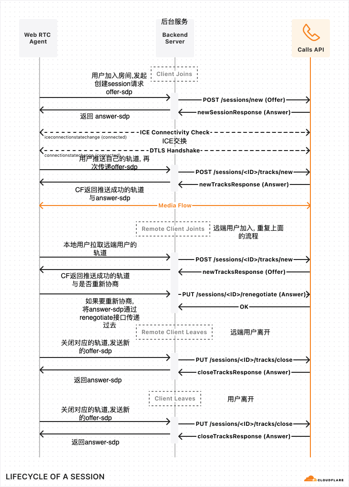

## Cloudflare 流程

### 细节补充

- 用户加入房间, 发起创建Sessions请求 (POST /apps/{appId}/sessions/new), 这一步需要创建Peer, 记得为Peer绑定track事件(获取远端传输过来的轨道), icecandidate事件等(交换ICE协议与是否完成交换ICE), connectionstatechange事件(当前的wbeRTC连接状态),
添加空轨道, 创建offer-sdp, 并设置本地描述, 请求成功后, CloudFlare会返回answer-sdp与SessionId, 将answer-sdp设置成远端描述

- 获取用户摄像头与音频权限, 拿到视频轨道与音频轨道, 将其添加进Peer, 生成offer-sdp, 将其设置成本地描述, 发起推送轨道请求(POST /apps/{appId}/sessions/{sessionId}/tracks/new), 请求成功会拿到推送成功的轨道信息与answer-sdp, 再次将answer-sdp设置成远端描述

- Sessions请求与推送轨道请求结束后, 将用户名称, SessionId, 轨道信息一并发送给后台服务, 当有远端用户加入房间, 会将其通知给房间内的所有人

- 当用户拿到后台发送过来的远端用户信息时, 会发起拉取远端用户轨道请求(POST /apps/{appId}/sessions/{sessionId}/tracks/new), 请求成功后, 将返回拉取回来的轨道信息, 这里有一个小细节(在ontrack事件中会获取到对应的真实轨道)将轨道信息与真实轨道一一对应, 之后看是否需要重新协商(CloudFlare返回), 如果需要, 则将请求返回的sdp设置成远端描述, 然后生成一个answer-sdp设置成本地描述, 调用重新协商会话请求(PUT /apps/{appId}/sessions/{sessionId}/renegotiate)传递answer-sdp给CloudFlare, 返回ok代表重新协商请求成功

- 当远端用户离开房间, 发起关闭轨道请求(PUT /apps/{appId}/sessions/{sessionId}/tracks/close), 你需要提供需要关闭的轨道信息与offer-sdp(记得添加到本地描述中), 成功后将返回的answer-sdp设置成远端描述

- 用户自己离开房间, 发起上面一样的流程, 并关闭用户自身webRTC服务
